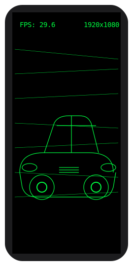

# Flamapp - Real-Time Edge Detection Viewer

This is a time-bound technical assessment to evaluate practical skills in Android development, OpenCV (C++), OpenGL ES, JNI (NDK), and TypeScript (Web). The focus is on integration and rendering.

## Features Implemented

### Android App
- **Camera Integration**: Uses `CameraX` for efficient camera stream capture.
- **JNI Bridge**: A robust JNI layer connects the Java/Kotlin application with the C++ processing backend.
- **Native Frame Processing**: Each camera frame is passed to C++ where it is converted from YUV to a grayscale image.
- **OpenCV Canny Edge Detection**: The grayscale frame is processed using OpenCV's Canny algorithm to detect edges.
- **OpenGL ES Rendering**: The final edge-detected image is rendered in real-time onto a `GLSurfaceView` as a texture.
- **Permissions**: Handles camera permissions gracefully.
- **Lifecycle Management**: The camera and OpenGL resources are managed according to the Android activity lifecycle.

### Web Viewer
- **TypeScript Setup**: A minimal web project is set up using TypeScript, ready to be built with `tsc`.
- **Static Frame Display**: Displays a sample processed frame (a placeholder checkerboard pattern).
- **Frame Statistics**: Includes a section to display mock statistics like resolution and FPS.
- **Simple & Clean UI**: A clean, centered layout to present the viewer.

##  Screenshots / GIF

*(TODO: Add a screenshot or GIF of the working Android application here.)*



##  Setup Instructions

### Prerequisites
1.  **Android Studio**: Make sure you have a recent version of Android Studio installed.
2.  **Android NDK**: Install the NDK from within Android Studio (`SDK Manager` > `SDK Tools` > `NDK (Side by side)`).
3.  **OpenCV for Android SDK**:
    *   Download the OpenCV Android SDK from the [official OpenCV website](https://opencv.org/releases/).
    *   Unzip the package to a known location on your computer (e.g., `C:/dev/OpenCV-android-sdk`).

### Configuration
1.  **Clone the repository**:
    ```bash
    git clone <repository-url>
    cd Flamapp
    ```
2.  **Configure OpenCV Path**:
    *   Open the `jni/CMakeLists.txt` file.
    *   You need to tell CMake where to find your OpenCV installation. You can do this by setting an environment variable `OpenCV_DIR` to point to the `sdk/native/jni` directory inside your unzipped OpenCV SDK.
    *   Alternatively, you can hardcode the path in `jni/CMakeLists.txt`. Uncomment and modify the following line:
        ```cmake
        # set(OpenCV_DIR /path/to/OpenCV-android-sdk/sdk/native/jni)
        ```
        For example:
        ```cmake
        set(OpenCV_DIR C:/dev/OpenCV-android-sdk/sdk/native/jni)
        ```

### Building and Running the Android App
1.  **Open in Android Studio**: Open the root folder of the project in Android Studio.
2.  **Sync Gradle**: Let Android Studio sync the project. It should automatically detect the NDK and CMake setup.
3.  **Build and Run**: Connect an Android device or use an emulator, then build and run the `app` configuration.
4.  **Grant Permissions**: The app will request camera permission on the first launch. You must grant it for the app to work.

### Running the Web Viewer
1.  **Navigate to the web directory**:
    ```bash
    cd web
    ```
2.  **Install dependencies**:
    ```bash
    npm install
    ```
3.  **Build the TypeScript code**:
    ```bash
    npm run build
    ```
4.  **Start the local server**:
    ```bash
    npm start
    ```
5.  Open your browser and navigate to `http://localhost:3000`.

##  Architecture Explanation

### Frame Flow (Android)
1.  **`CameraHandler.java`**: Uses the CameraX `ImageAnalysis` use case to get frames from the camera as `ImageProxy` objects on a background thread.
2.  **YUV to Native**: The Y, U, and V planes of the `ImageProxy` (in YUV_420_888 format) are accessed as `ByteBuffer`s and passed directly to a JNI function (`nativeOnFrame`).
3.  **`Processor.cpp`**: In the native layer, the Y-plane (grayscale) is wrapped in an OpenCV `cv::Mat`.
4.  **OpenCV Canny**: The `cv::Canny` function is applied to the grayscale `Mat` to produce an edge map.
5.  **`Renderer.cpp`**: The single-channel Canny output is converted to a 4-channel RGBA `Mat` and then uploaded to an OpenGL texture using `glTexImage2D`.
6.  **`MainGLSurfaceView.java`**: The `onDrawFrame` callback in the `MainRenderer` calls the native `nativeOnDrawFrame` function, which draws a simple quad textured with the processed camera frame.

### TypeScript Part
The web component is completely decoupled. It's a minimal static site built with TypeScript to demonstrate frontend capabilities.
-   `main.ts` contains the logic to load a static placeholder image and display its (mock) properties.
-   It is built using `tsc` and served with `lite-server`.
-   In a more advanced scenario, this could be connected to the Android app via WebSockets to provide a real-time debug view.
